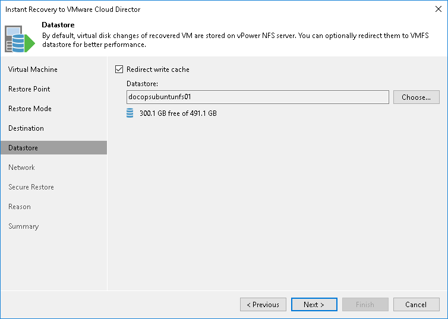

# Step 6. Select Destination for Virtual Disk Updates

The Datastore step of the wizard is available if you have chosen to change the location and settings of the restored VM.

Select the location for holding the VM disk changes when the VM is restored. By default, disk changes are stored directly on the vPower NFS server. However, you can store disk changes on any datastore in your virtual environment.

To select a datastore:

1. Select the Redirect virtual disk updates check box.
2. From the Datastore list, choose the necessary datastore. You can select only a datastore that is available in the organization VDC hosting the vApp to which the VM is restored.

