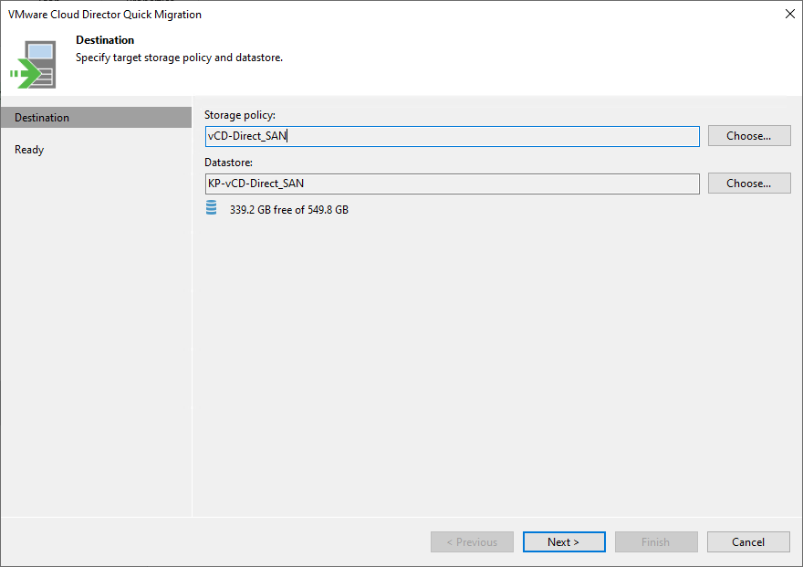
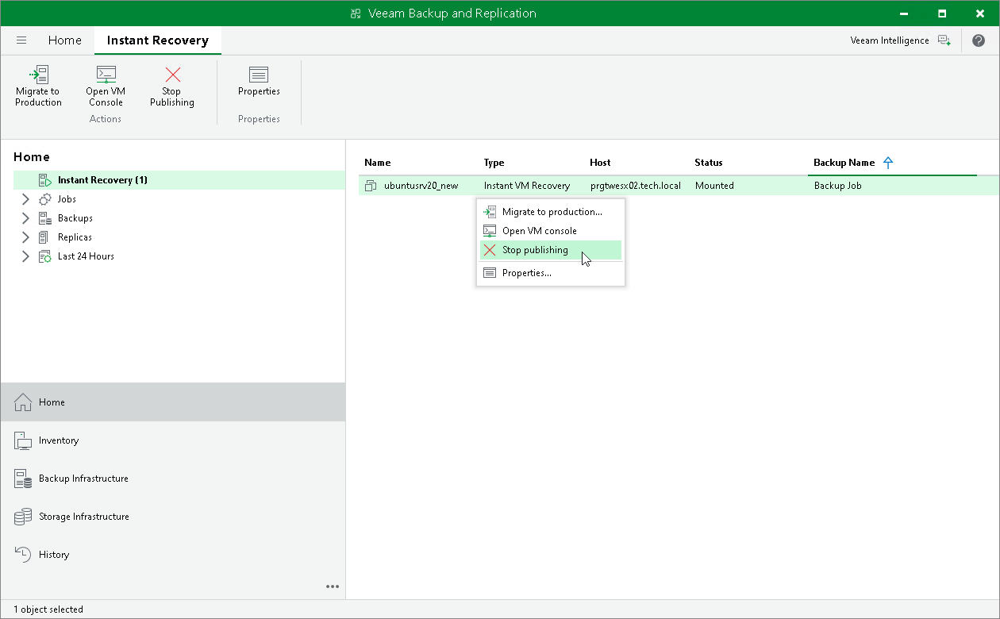

# Step 11. Finalizing Instant Recovery

In this article

All VMs restored with Instant Recovery are displayed in the Home view, under the Instant Recovery node.

To check the progress of Instant Recovery and view session details:

1. Open the Home view.
2. In the inventory pane, click the Instant Recovery node.
3. Right-click the VM in the working area and select Properties.

Alternatively, you can open the History view, select the Instant Recovery node under Restore in the inventory pane and double-click the necessary instant restore session.

After the VMs have been successfully recovered, you must finalize the process. For this, test the recovered VMs and decide whether to migrate them to production environment or stop publishing.

* [Testing recovered VMs](#test)

* [Migrating recovered VMs](#migrate)
* [Stop publishing recovered VMs](#remove)

Testing Recovered VMs

To test the recovered VMs before you migrate them to production, you can launch VMware Remote Console software from the Veeam Backup & Replication console.

|  |
| --- |
| Important |
| Before you launch VMware Remote Console, make sure that this software is installed on the machine where the Veeam Backup & Replication console runs. |

To open a VM console in Veeam Backup & Replication:

1. Open the Home view.
2. In the inventory pane, select the Instant Recovery node.
3. In the working area, right-click a VM and select Open VM console.

Migrating Recovered VM

To migrate the restored VM to production:

1. Open the Home view.
2. In the inventory pane, select the Instant Recovery node.

1. In the working area, right-click the VM and select Migrate to production. Veeam Backup & Replication will launch the VMware Cloud Director Quick Migration wizard.
2. At the Destination step of the wizard, specify the target storage policy and datastore where the VMs must be relocated.

1. At the Ready step of the wizard, check the migration settings and click Finish.

During migration, Veeam Backup & Replication will restore the VM from the backup file and additionally move all changes that were made while the VM was running from the backup in the Instant Recovery mode.

Stop Publishing Recovered VM

If you have disabled the Delete source VM files upon successful migration option in the Quick Migration settings, you must unpublish the VM manually. After you unpublish the VM, the Instant Recovery session will end and the recovered VM will be unmounted from the vPower NFS server. The migrated VM will remain on the production environment.

To unpublish a recovered VM:

1. Open the Home view.
2. In the inventory pane, select the Instant Recovery node.
3. In the working area, right-click the VM and select Stop publishing.

|  |
| --- |
| Tip |
| After the VM has been published from the backup, you can open the VM console directly from Veeam Backup & Replication. To do this, in the working area right-click the VM and select Open VM Console. |

Page updated 9/1/2025

Page content applies to build 13.0.1.1071
