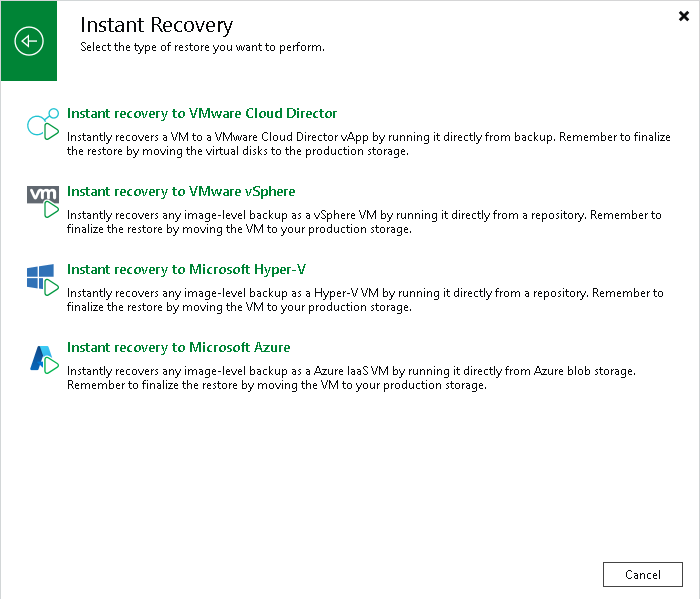

# Step 1. Launch Instant Recovery to VMware Cloud Director Wizard

To launch the Instant Recovery to VMware Cloud Director wizard, do one of the following:

* Open the Home view. In the inventory pane, select Backups. In the working area, expand the necessary backup and do one of the following:

+ Select the machine that you want to restore and click Instant Recovery > VMware Cloud Director on the ribbon.
+ Right-click the machine that you want to restore and select Instant recovery > VMware Cloud Director.

* On the Home tab, click Restore > VMware Cloud DIrector. In the Restore window, select Restore from backup > VM restore > Entire VM restore > Instant recovery > Instant recovery to VMware Cloud Director.

* Open the Inventory view. On the View tab, click Cloud Director View. In the inventory pane, expand the vCloud Director hierarchy. In the working area, right-click the VM you want to restore and select Restore > Instant recovery > VMware Cloud Director.

