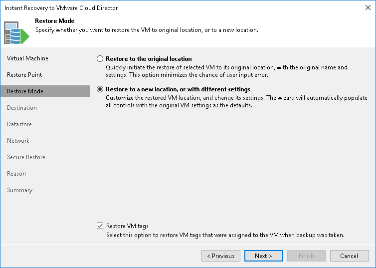

# Step 4. Select Restore Mode

At the Restore Mode of the wizard, choose the necessary restore mode.

1. Choose a restore mode:

+ Select Restore to the original location if you want to restore the VM with its initial settings to its original location. If this option is selected, you will pass directly to the [Reason](vcloud_instant_to_vcd_reason.md) step of the wizard.
+ Select Restore to a new location, or with different settings if you want to restore the VM to a different location or with different settings (such as vApp, VM name, network settings and so on). If this option is selected, the Instant Recovery wizard will include additional steps for customizing VM settings.

1. Select the Restore VM tags check box if you want to restore tags that were assigned to the original VM, and assign them to the restored VM. Veeam Backup & Replication will restore the VM with original tags if the following conditions are met:

+ The VM is restored to its original location.
+ The original VM tag is still available on the source vCenter Server.

