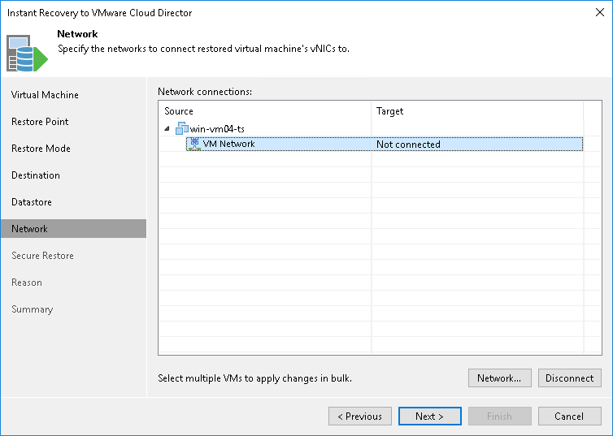

# Step 7. Select Destination Network

The Network step of the wizard is available if you have chosen to change the location and settings of the restored VM.

To select networks to which restored VMs must be connected:

1. Select a VM in the list and click Network.
2. The Select Network window displays all networks that are configured for the destination vApp. From the list of available networks, choose a network to which selected VM should have access upon restore.

To facilitate selection, use the search field at the bottom of the window: enter a network name or a part of it and click the Start search button on the right or press [Enter] on the keyboard.

1. To prevent the restored VM from accessing any network, select it in the list and click Disconnect.

Veeam Backup & Replication maps the network settings you define and network settings of the original VM. If necessary, Veeam Backup & Replication makes changes to the network settings of the recovered VM. For example, if the original VM was connected to the network using the static IP mode and you have selected to connect a recovered VM to a network using the dynamic IP mode, Veeam Backup & Replication will change the network settings to the dynamic mode.

