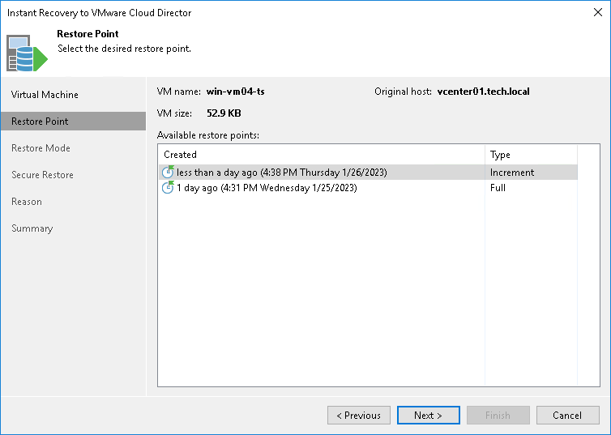

# Step 3. Select Restore Point

In this article

At the Restore Point step of the wizard, select the restore point for the VM.

In the Location column, you can view a name of a backup repository where a restore point resides.

Page updated 2/26/2024

Page content applies to build 13.0.1.1071
