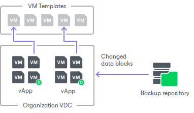
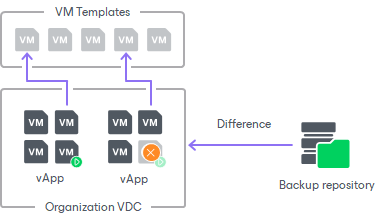
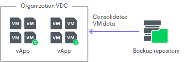

# How Restore of Linked Clone VMs to VMware Cloud Director Works

Veeam Backup & Replication lets you restore linked clone VMs – VMs that were deployed from a VM template using the fast provisioning technology. There are several mechanisms for processing linked clone VMs.

Restore of Existing VMs

If you are restoring a VMware Cloud Director linked clone VM that exists in the VMware Cloud Director hierarchy, the restore process includes the following steps:

1. Veeam Backup & Replication uses the captured vApp metadata to define the initial settings of the VM.
2. Veeam Backup & Replication calculates a signature for the consolidated VM disk in the backup file (containing the VM template data and data of the delta file) and the signature for the VM existing in VMware Cloud Director. Veeam Backup & Replication then compares the disk signatures to define what data blocks have changed.
3. Veeam Backup & Replication restores only changed data blocks from the backup file and writes them to the user delta file.

Restore of Deleted VMs

If you are restoring a VM that no longer exists in VMware Cloud Director hierarchy, the restore process includes the following steps:

1. Veeam Backup & Replication uses VMware Cloud Director to create a new linked clone VM from the VM template that the user selects. The new VM has a blank user delta file.
2. Veeam Backup & Replication calculates a signature for the consolidated VM disk in the backup file (containing the VM template data and data of the delta file) and the signature for the created VM in VMware Cloud Director. Veeam Backup & Replication then compares the disk signatures to define what data blocks need to be restored.
3. Veeam Backup & Replication restores only those data blocks that need to be restored from the backup file and writes them to the blank user delta file.

By default, Veeam Backup & Replication links the VM to the same VM template that was used by the original VM. During restore, Veeam Backup & Replication checks the settings of the VM template to which the restored VM is linked: verifies connection settings, makes sure the disk size coincide and so on.

Restore of Linked Clone VMs as Regular VMs

In some cases, Veeam Backup & Replication can restore a VM from a backup file as a regular VM. This type of restore is accomplished in the following situations:

* You have intentionally chosen to restore a linked clone VM as a regular VM.
* You are restoring a VM to the organization VDC which has the fast provisioning option disabled.
* A VM template to which the restored VM should be linked is not accessible in the location to which the VM is restored.

In this case, Veeam Backup & Replication uses the same algorithm as for restore of full VMs in the virtual environment. It retrieves the data of the consolidated VM disk from the backup file and restores the VM in the VMware Cloud Director hierarchy.

