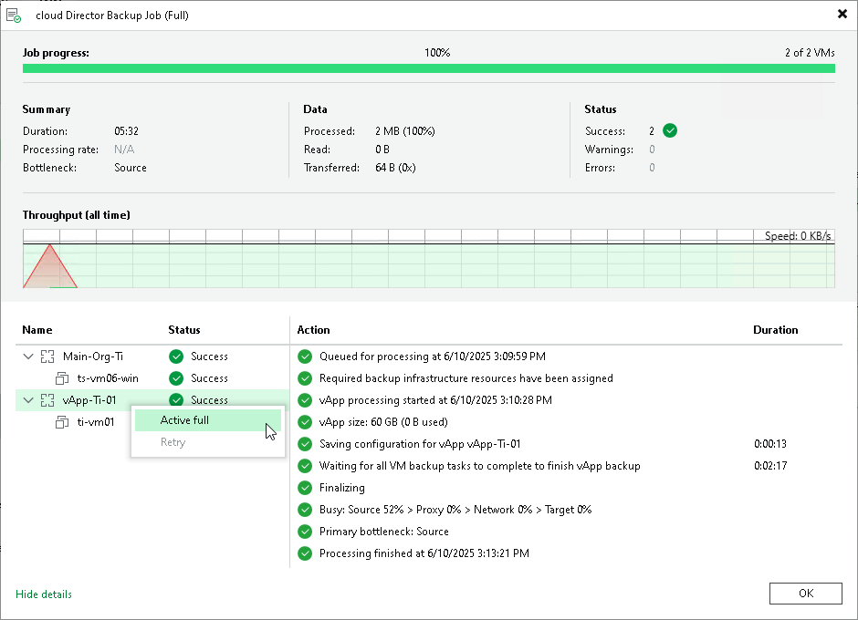

# Managing Cloud Director Backups and Jobs

In this article

Managing for Cloud Director backups and jobs is practically the same as for regular backups. You can view backup properties, copy, move, export and delete backups from disk. For more information, see the following sections:

* [Viewing Backup Properties](view_backup_properties.md)
* [Moving Backups](move_backup.md)
* [Copying Backups](copy_backup.md)
* [Exporting Backups](exporting_backups.md)
* [Deleting Backups from Disk](delete_backup_from_disk.md)
* [Detaching Backups from Jobs](detach_backup.md)
* [Editing Job Settings](editing_jobs.md)
* [Cloning Jobs](cloning_jobs.md)
* [Retrying Jobs](retrying_jobs.md)
* [Disabling and Deleting Jobs](disabling_jobs.md)
* [Starting and Stopping Jobs](jobs_start_stop.md)
* Performing Active Full Backup

You can perform active full backup for the whole job as described in [Performing Active Full Backup](performing_active_full_backup.md) or create a partial active full backup as described further in this section.

|  |
| --- |
| Note |
| Consider the following:   * When you launch a retry for a vApp, Veeam Backup & Replication performs retry for the vApp and its failed VMs. When you launch the retry for a VM, Veeam Backup & Replication performs retry only for this VM. * You cannot retry a backup job targeted at an immutable repository. That is because the last session of the preceding automatic retry session makes immutable not only VM backup files but also the vApp backup file. Then this manual retry tries to change this immutable vApp backup file and fails.   Instead of the manual retry, you can [create an active full backup](performing_active_full_backup.md). This operation can help because it creates new vApp backup files. Note that automatic job retry can still be used because it makes the vApp backup file immutable only on the last retry session.   * The move and copy operations are available at the backup job level and at the vApp level. You cannot use these operations for individual VMs. |

Performing Partial Active Full Backup

You can create a partial active full backup, that is, create a backup for an individual vApp or an individual VM. When you launch the active full backup for an individual vApp, Veeam Backup & Replication creates the active full backup for the vApp and its VMs that the job processes. When you launch the active full backup for an individual VM, Veeam Backup & Replication creates the active full backup for the VM and its parent vApp.

To create a partial active full backup:

1. Open [real-time statistics](realtime_statistics.md) or [sessions results](session_results.md) of the job.
2. Select a vApp or VM for which you want to perform active full backup.
3. Right-click one of the selected workload and click Active full. Note that you will be able to launch active full backup for other workloads only after the running session finishes.

Page updated 6/10/2025

Page content applies to build 13.0.1.1071
