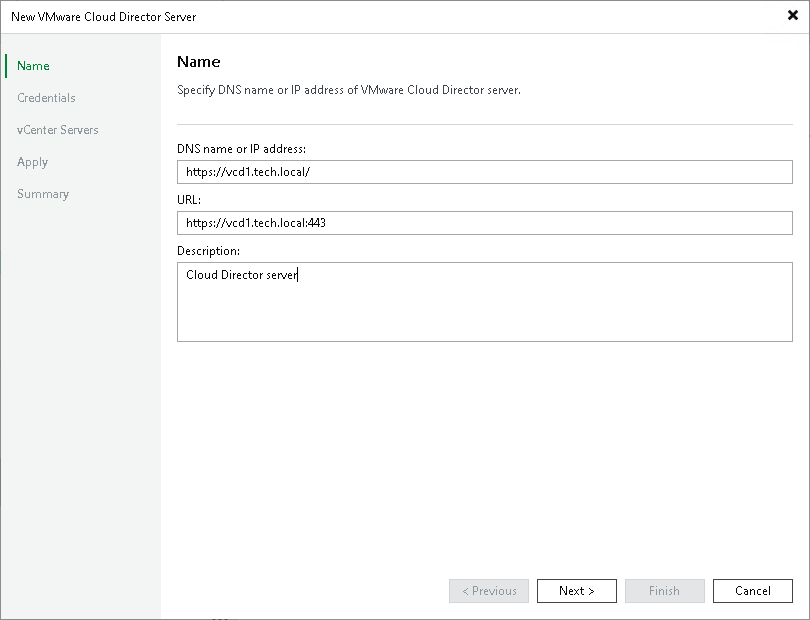

# Step 2. Specify Server Name or Address

In this article

At the Name step of the wizard, specify connection settings for VMware Cloud Director. If the VMware Cloud Director infrastructure comprises several cells, you can specify connection settings for any cell in the VMware Cloud Director hierarchy.

1. In the DNS name or IP address field, enter a full DNS name, or IPv4 or IPv6 address of the VMware Cloud Director server or any cell in the VMware Cloud Director infrastructure. Note that you can use IPv6 addresses only if IPv6 communication is enabled as described in section [IPv6 Support](ipv6.md).
2. In the URL field, enter a URL of the VMware Cloud Director server. By default, Veeam Backup & Replication uses the following URL: https://<clouddirectorservername>:443, where <clouddirectorservername> is the name or IP address of the VMware Cloud Director server that you have specified in the field above and 443 is the default port for communication with VMware Cloud Director.
3. In the Description field, provide a description for future reference. The default description contains information about the user who added the server, date and time when the server was added.

Page updated 6/10/2025

Page content applies to build 13.0.1.1071
