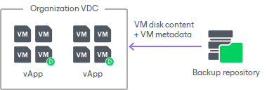

# How Restore of Regular and Standalone VMs to VMware Cloud Director Works

Veeam Backup & Replication lets you restore regular VMs that are part of vApps and standalone VMs that were created in the VMware Cloud Director tenant portal.

When you restore regular or standalone VMs back to the VMware Cloud Director hierarchy, the restore process includes the following steps:

1. Veeam Backup & Replication uses the captured vApp metadata to define the vApp settings and VM original location in the VMware Cloud Director hierarchy.
2. Veeam Backup & Replication restores VMs from the backup file to their original location or to a different location. Additionally, Veeam Backup & Replication restores all VM settings.

