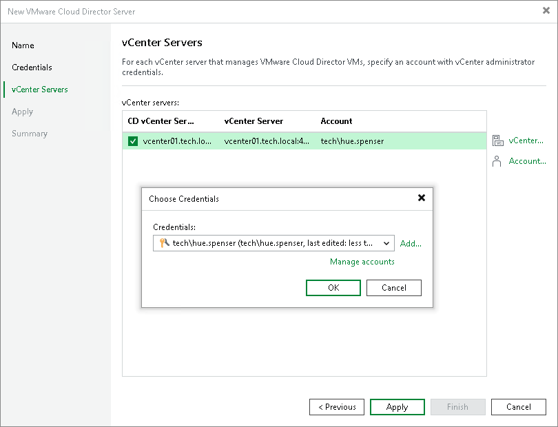

# Step 4. Specify Credentials for Underlying vCenter Servers

In this article

At the vCenter Servers step of the wizard, specify credentials for every vCenter Server added to VMware Cloud Director. If the vCenter Server is already added to the backup infrastructure, you do not need to specify credentials for it once again. Veeam Backup & Replication will automatically detect the credentials you provided when adding this vCenter Server and use them.

1. From the vCenter servers list, select a vCenter Server.
2. Click Account on the right and select credentials to connect to the vCenter Server. By default, Veeam Backup & Replication uses the same credentials that you have specified for VMware Cloud Director at the previous step of the wizard.

If you have not set up the credentials beforehand, click the Manage accounts link at the bottom of the list or click Add on the right to add the credentials. For more information, see [Credentials Manager](credentials_manager.md).

1. Veeam Backup & Replication automatically detects a port used to communicate with the vCenter Server. If necessary, you can change the connection port for the vCenter Server. Click vCenter on the right and adjust the port number.

When you add a vCenter Server, Veeam Backup & Replication saves a thumbprint of the TLS certificate installed on the vCenter Server to the configuration database. During every subsequent connection to the server, Veeam Backup & Replication uses the saved thumbprint to verify the server identity and avoid the man-in-the-middle attack. For details on managing TLS Certificates, see [Backup Server Certificate](backup_server_certificate.md).

If the certificate installed on the server is not trusted, Veeam Backup & Replication displays a warning.

+ To view detailed information about the certificate, click View.
+ If you trust the server, click Continue.
+ If you do not trust the server, click Cancel. Veeam Backup & Replication will display an error message, and you will not be able to connect to the server.

|  |
| --- |
| Note |
| When you update a certificate on a server, this server becomes unavailable in the Veeam Backup & Replication console. To make the server available again, acknowledge the new certificate at the Credentials step of the [Edit Server](edit_server.md) wizard. |

Page updated 6/10/2025

Page content applies to build 13.0.1.1071
