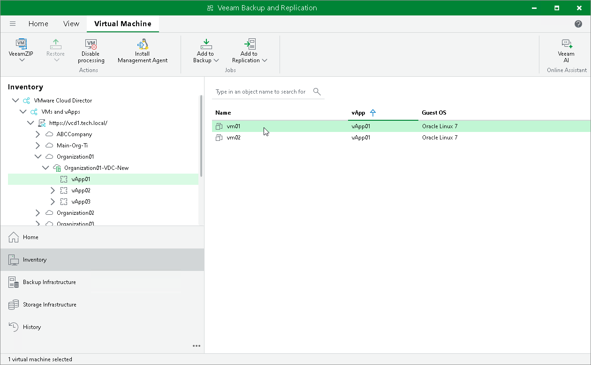

# Viewing VMware Cloud Director VMs

To get access to VMware Cloud Director, you need to [add the VMware Cloud Director server](adding_vcloud_director.md) to the backup infrastructure. After that, you can view the VMware Cloud Director hierarchy in Veeam Backup & Replication and work with Cloud Director VMs.

To open the VMware Cloud Director hierarchy:

1. Open the Inventory view.
2. Click the View tab on the ribbon.
3. On the View tab, click Cloud Director View.

The hierarchy of the VMware Cloud Director server will become available in the inventory pane. VMs managed by VMware Cloud Director will be displayed in the working area. You can work with these VMs just as if you worked with VMs managed by vCenter Servers or registered on ESXi hosts in your backup infrastructure.

