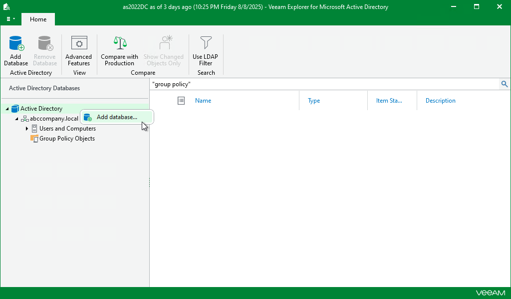
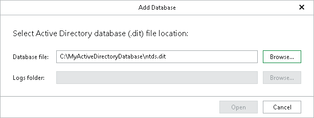

# Adding Standalone Databases

In this article

To add a standalone Active Directory database manually, do the following:

1. Select the root Active Directory node in the navigation pane and click Add Database on the ribbon or right-click the Active Directory node and select Add database.

1. Specify the location of the Active Directory database file and folder that contains associated transaction log files (Edb.log and Edb.chk) and click Open.

You can click the Browse buttons to search the database file or the logs folder in the directory structure of the machine where Veeam Explorer for Microsoft Active Directory is opened.

By default, the Active Directory database file (NTDS.DIT) is located in the %SystemRoot%\NTDS directory. Make sure that the system registry hive is located in the same place.

Page updated 8/12/2025

Page content applies to build 13.0.1.1071
