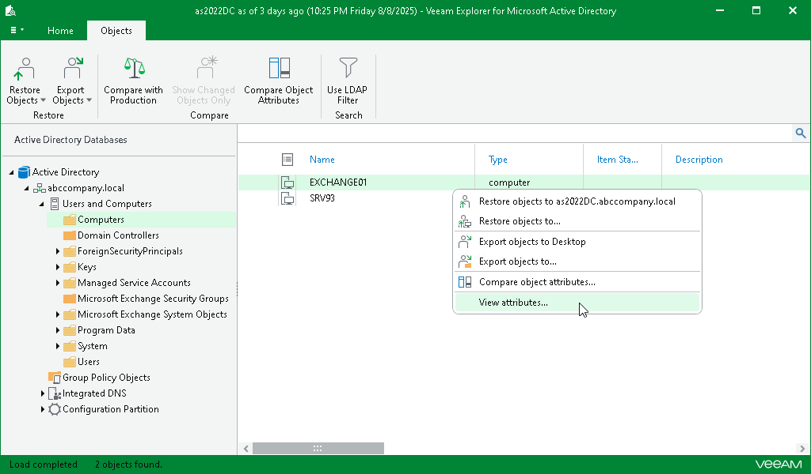
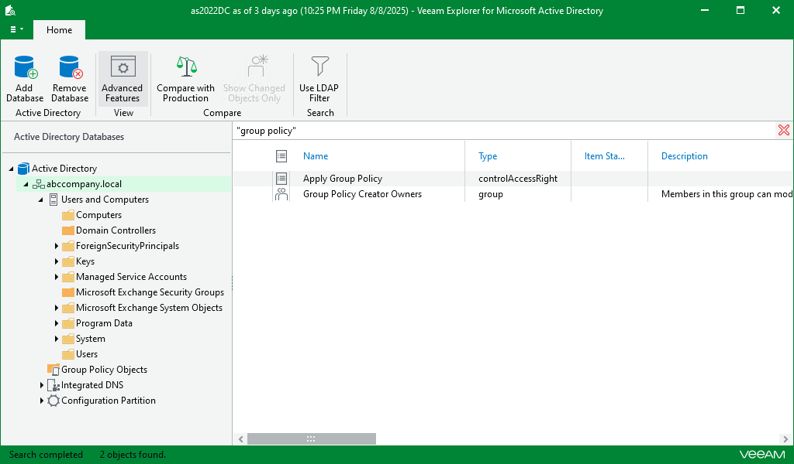
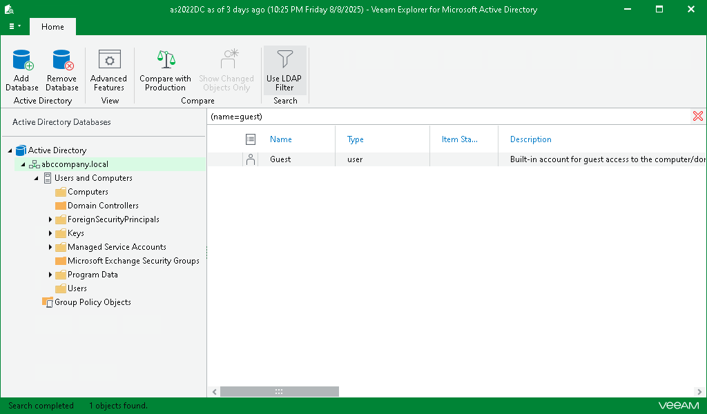

# Browsing, Searching and Viewing Items

In this article

This topic explains how to use Veeam Explorer for Microsoft Active Directory to:

* [Browse backup content](#browsing)
* [Search for objects in a backup file](#searching)

Browsing

To view the contents of a backup file, use the navigation pane which shows you the database structure containing your active directory objects. After you select a container in the navigation pane, you can see its contents in the preview pane.

Right-click an object and select View attributes to view object attributes. To copy necessary attributes to the clipboard, select an attribute and press [Ctrl+C] on the keyboard. Multiple selection is also supported.

Veeam Explorer for Microsoft Active Directory does not display some objects and containers in the default view, such as the entire Microsoft Exchange System Options, System, Integrated DNS, Configuration Partition containers, as well as the objects stored in the Domain Controllers container. This behavior is intended to prevent accidental errors during the recovery process that may affect the system stability of the target machine.

You can view and recover some of this data if you open the Home tab and enable Advanced Features, but you must manually verify all recovery operations to ensure stable operation of the system.

Searching

The search mechanism allows you to find items matching specified search criteria.

To search for the required items, do the following:

1. In the navigation pane, select an object in which you want to find your data.
2. Enter a search query in the search field at the top of the preview pane. Then press [Enter] or click the Search button to the right of the search field.

|  |
| --- |
| Note |
| To find the exact phrase, use double quotes. For example, "group policy". |

Using LDAP Queries

To use the LDAP search query, do the following:

1. In the navigation pane, select a container.
2. On the ribbon menu, click Use LDAP Filter.
3. In the search field, enter an LDAP query. Then press [Enter] or click the Search button to the right of the search field.

Page updated 12/2/2025

Page content applies to build 13.0.1.1071
