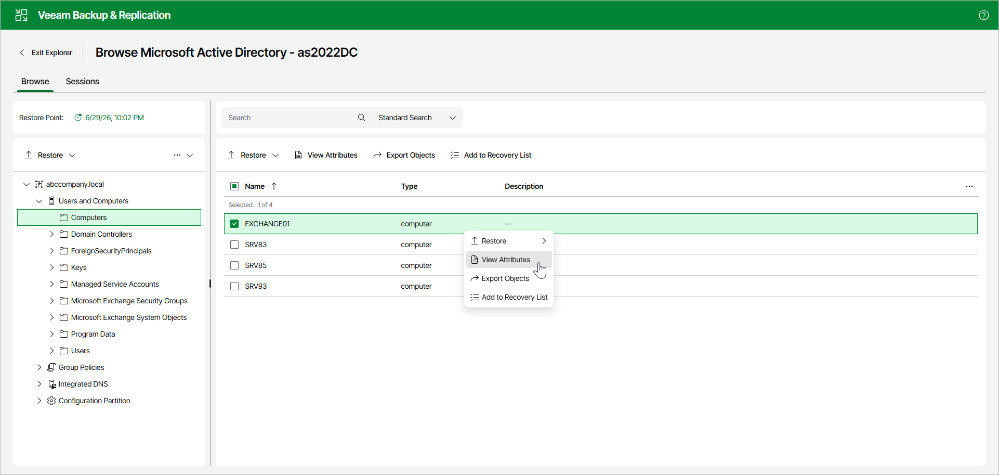
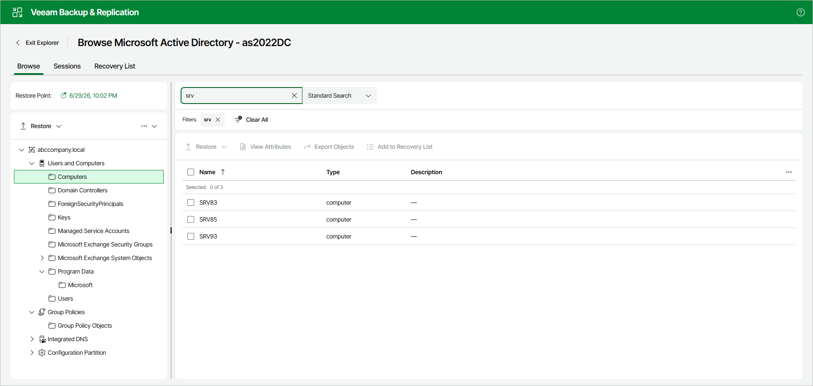
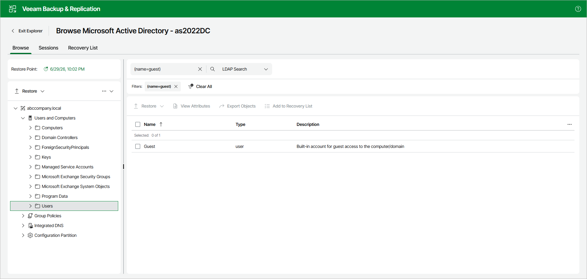

# Browsing, Searching and Viewing Items

This topic explains how to use Veeam Explorer for Microsoft Active Directory to:

* [Browse backup content](#browsing)
* [Search for objects in a backup file](#searching)

Browsing

To view the contents of a backup file, open the Browse tab and go to the navigation pane. It shows the hierarchy of Active Directory containers in the backup. After you select a container in the navigation pane, you can see its contents in the preview pane.

To view container or object attributes, do the following:

1. In the navigation pane, select a container; or in the preview pane, select a container or an object.
2. In the upper part of the navigation or preview pane, click View Attributes.

Alternatively, you can right-click the container or object and select View Attributes.

Searching

The search mechanism allows you to find items matching specified search criteria.

To search for the required items, do the following:

1. In the navigation pane, select the container in which you want to search for items.
2. From the drop-down list next to the Search field, select Standard Search.
3. In the Search field, enter a search query. Then press [Enter] or click the search icon.

|  |
| --- |
| Note |
| To find the exact phrase, use double quotes. For example, "group policy". |

Using LDAP Queries

To use an LDAP search query, do the following:

1. In the navigation pane, select a container.
2. From the drop-down list next to the Search field, select LDAP Search.
3. In the Search field, enter an LDAP query. Then press [Enter] or click the search icon.

Page updated 2026-07-13

