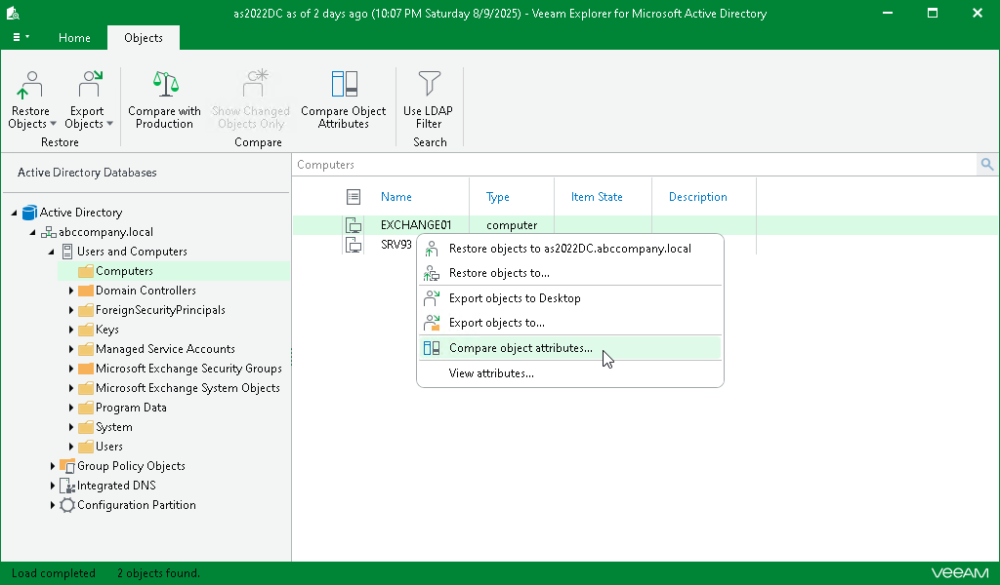
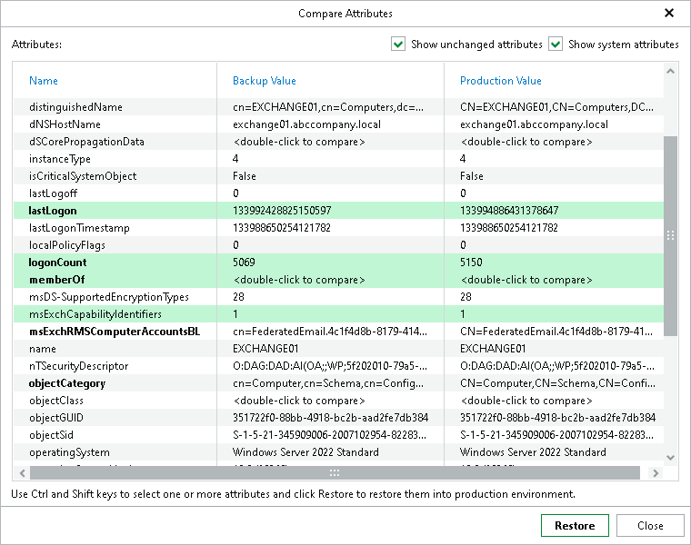

# Comparing Object Attributes

To compare Active Directory objects attributes, do the following:

1. In the navigation pane, select a container.
2. In the preview pane, select an object.
3. On the Objects tab, select Compare object attributes or right-click an object and select Compare object attributes.

1. Review changed attributes.

To show unchanged attributes, select Show unchanged attributes at the top-right corner. To show system properties, select Show system attributes.

To restore an attribute, select it and click Restore. Multiple selection is also supported.

