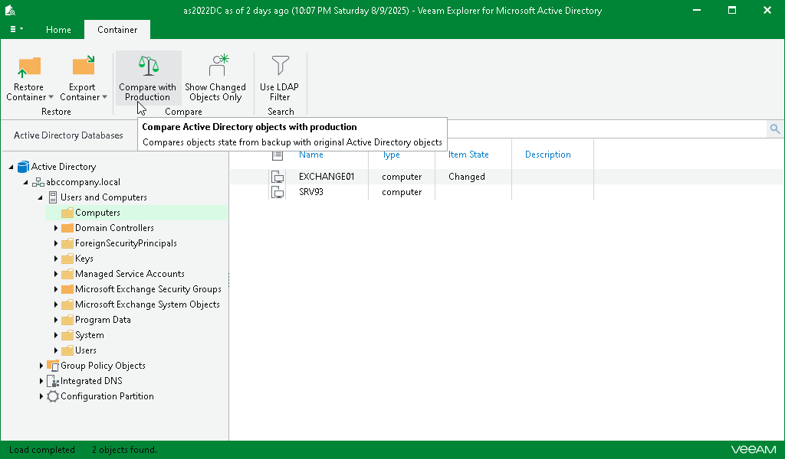
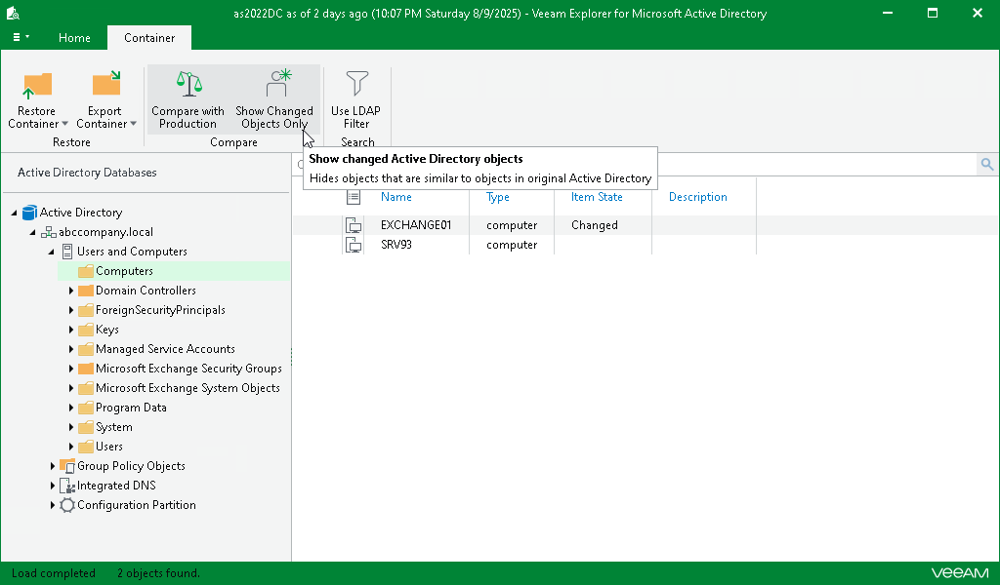

# Comparing Active Directory Containers

In this article

To compare Active Directory containers, do the following:

1. In the navigation pane, select a container.
2. On the Home tab, select Compare with Production to detect changed, moved or deleted objects since the last Active Directory backup.

1. Click Show Changed Objects Only on the ribbon to view only those items that have been changed since the last backup.

The following figure shows user accounts the attributes of which have been changed since the last time they were backed up. Veeam Explorer for Microsoft Active Directory can also combine item states to represent the most accurate state of an object. For example, if object attributes have been changed and the object was moved to a different location, the object status in this case will be shown as Moved, Changed.

Page updated 8/12/2025

Page content applies to build 13.0.1.1071
