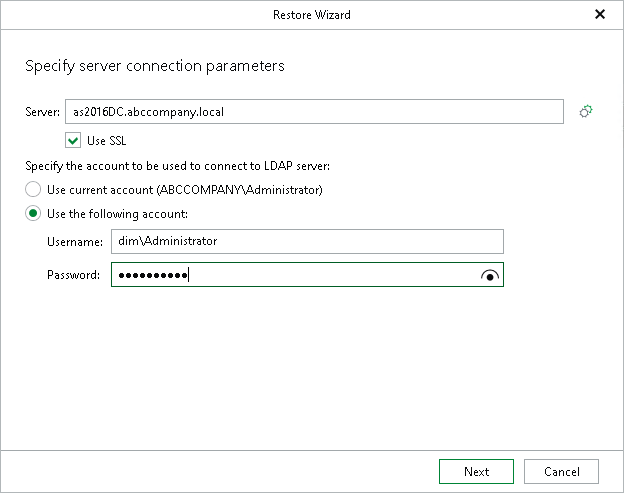
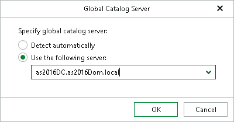

# Step 2. Specify Connection Parameters

At this step of the wizard, do the following:

1. In the Server field, specify the DNS name or IP address of the target server to which you want to restore your data.

Select the Use SSL check box to establish a secure SSL connection.

1. In the Specify the user account to be used to connect to LDAP server section, select either of the following options:

* Use current account. Select this option to connect to the LDAP server using the account under which Veeam Explorer for Microsoft Active Directory is running.

* Use the following account. Select this option to connect to the LDAP server using a custom user account. Then provide a user name and password for the account.

Global Catalog Server

To specify a Global Catalog server, click the Settings button on the right side of the Server field and choose either of the following options:

* Detect automatically — to automatically detect a server.
* Use the following server — to choose a server from the list.

