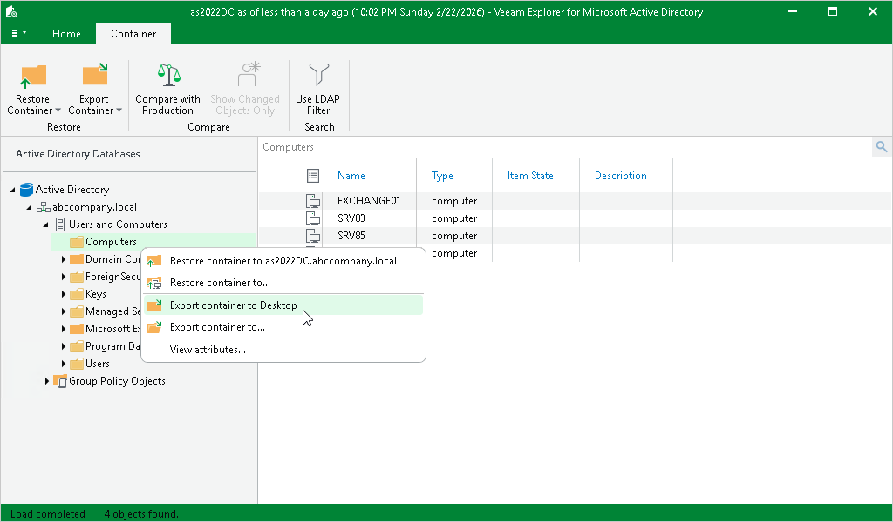

# Exporting Containers to Default Location

To export a container to the default location, do the following:

1. Select a container.
2. On the Container tab, select Export Container > Export Container to <target\_folder>.

Alternatively, you can right-click a container and select Export container to <target\_folder>.

|  |
| --- |
| Note |
| The <target\_folder> destination depends on the location you used during the last export operation. |

Page updated 2026-05-26

