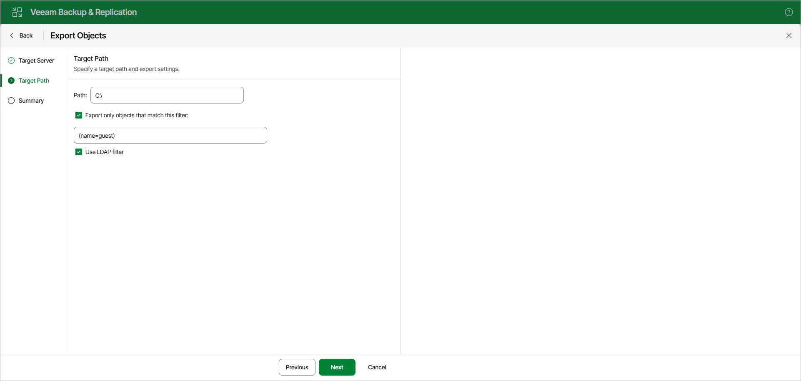

# Step 3. Specify Export Location

At the Target Path step, do the following:

1. In the Path field, specify the path to the folder on the target Windows server to which you want to export the data.
2. To export only objects that match a specific filter, select the Export only objects that match this filter check box and specify the filter in the following field.
3. Select the Use LDAP filter check box to apply the specified filter as an LDAP search filter.

|  |
| --- |
| Note |
| The account you are using must have a sufficient permission level to access the selected directory (Read and Write as minimum recommended). |

Page updated 2026-07-07

