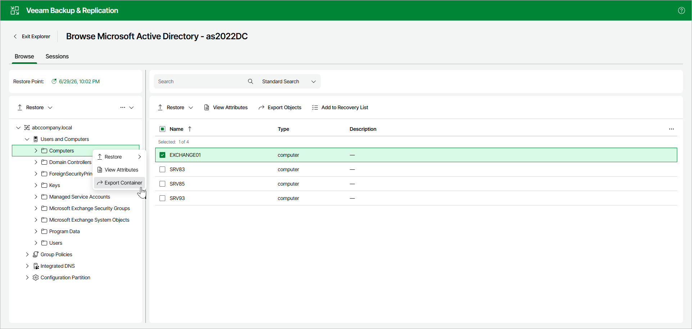

# Step 1. Launch Export Wizard

To launch the Export wizard, open the Browse tab and do the following:

1. In the navigation pane, select a container.
2. In the upper part of the navigation pane, click Export Container.

Alternatively, you can open the Browse tab, right-click the container and select Export Container.

Page updated 2026-07-08

