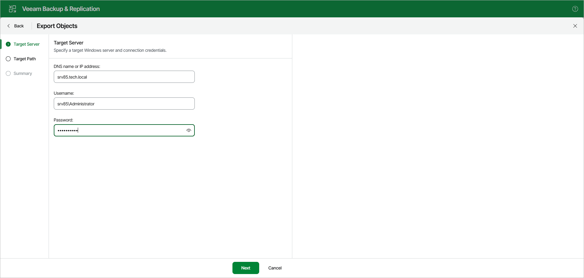

# Step 2. Specify Target Server

At the Target Machine step, specify the DNS name or IP address of the target Windows server and the credentials of an account that can access it.

Page updated 2026-07-10

