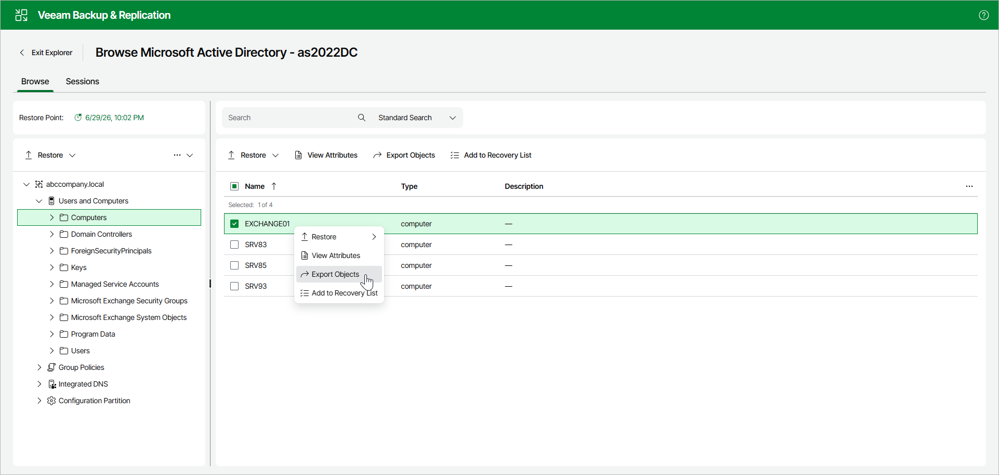

# Step 1. Launch Export Wizard

To launch the Export wizard, open the Browse tab and do the following:

1. In the preview pane, select objects.
2. In the upper part of the preview pane, click Export Objects.

Alternatively, you can open the Browse tab, right-click the object and select Export Objects.

Page updated 2026-07-08

