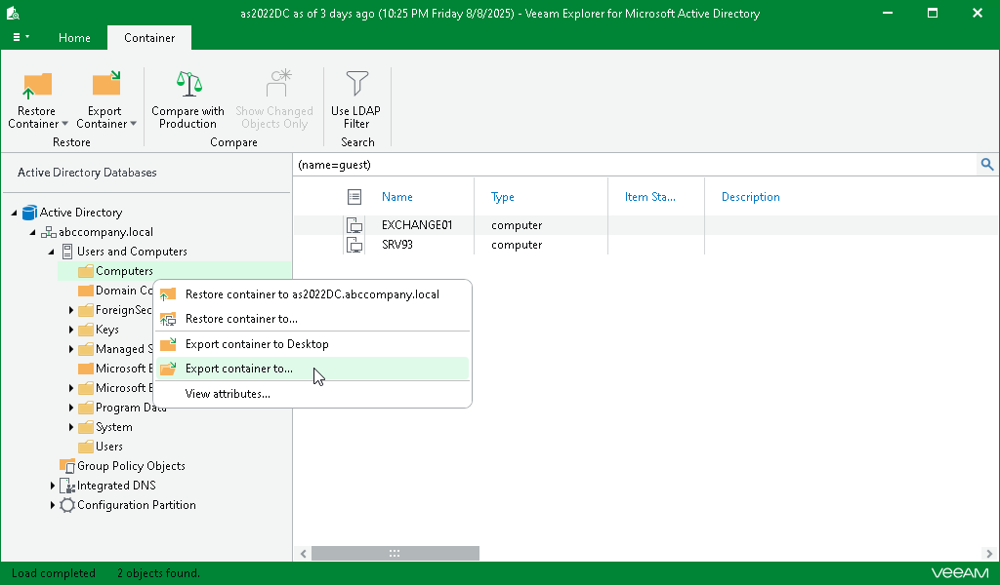
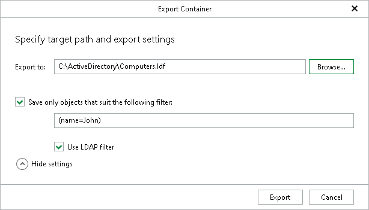

# Exporting Containers

To export containers and their contents, do the following:

1. In the preview pane, select a container.
2. On the Container tab, select Export Container > Export container to or right-click a container and select Export container to.

1. In the Export Container window, in the Export to field, specify the destination location.

To save only objects included in the selected container and meet specific filtering criteria, click Show settings to set the filter.

1. [Optional] Select the Save only objects that suit the following filter check box and enter filtering criteria.

If necessary, select the Use LDAP filter check box to switch to the LDAP filtering mode.

1. Click Export.

All nested containers (if any) will be preserved during the export.

