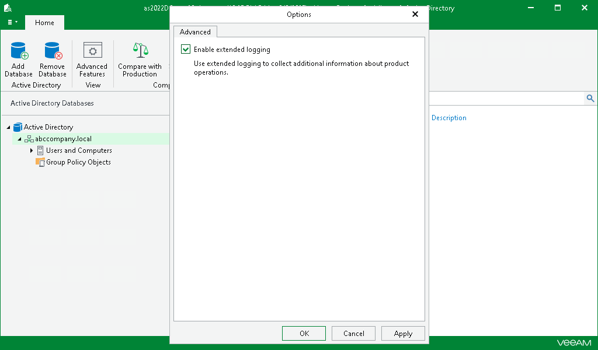

# Enabling Extended Logging

Veeam Explorer for Microsoft Active Directory allows you to enable an extended logging mode to collect more detailed logs on specific operations. After you enable extended logging, you can go back to the application and perform the actions for which you want to collect additional information. Then you can collect the logs. For more information on log collection, see [Getting Support](vead_support.md).

To configure extended logging mode, do the following:

1. Go to the main menu and click General Options.
2. On the Advanced tab, select the Enable extended logging check box and click OK.
3. Go back to the application, perform necessary actions and then review the logs to see the details.

