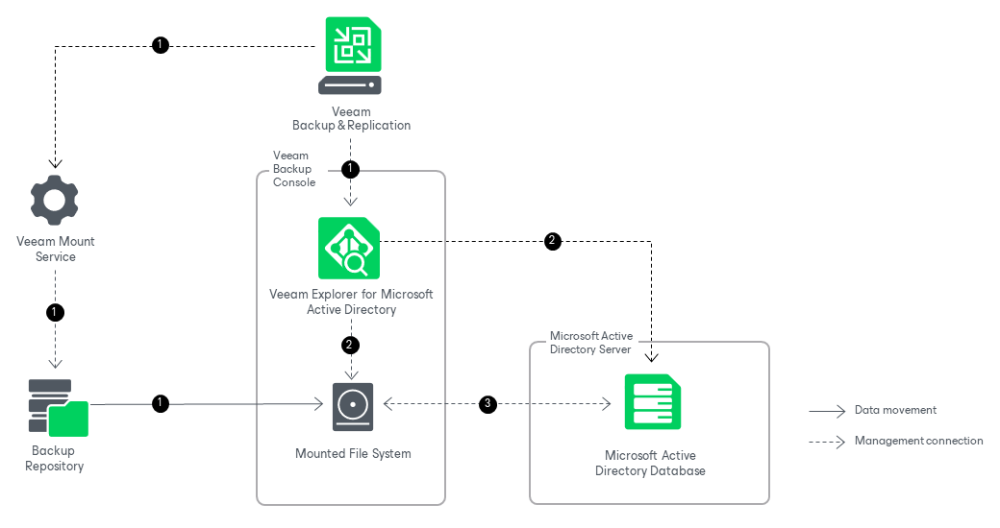

# How Compare Works

Veeam Explorer for Microsoft Active Directory allows you to compare your data on the backup file with its present state on the original machine used to create the backup.

Comparing Microsoft Active Directory data works in the following manner:

1. After you select a restore point, Veeam Backup & Replication launches Veeam Explorer for Microsoft Active Directory. Meanwhile, Veeam Backup & Replication sends a mount command to the Veeam Mount Service running on the mount server associated with the backup repository. The Veeam Mount Service mounts the file system to the machine where Veeam Explorer for Microsoft Active Directory is opened.
2. Veeam Explorer for Microsoft Active Directory locates the ntds.dit file and the associated transaction logs (usually in the %SystemRoot%\NTDS folder) on the mounted file system. To read these files, Veeam Explorer for Microsoft Active Directory uses the native Windows Extensible Storage Engine dynamic link library (esent.dll) located in the %SystemRoot%\System32 folder of the machine where Veeam Explorer for Microsoft Active Directory is opened.

Veeam Explorer for Microsoft Active Directory also connects to Microsoft Active Directory on the original machine.

1. Veeam Explorer for Microsoft Active Directory compares Microsoft Active Directory containers or object attributes on the backup with their present state on the original machine. Veeam Explorer for Microsoft Active Directory displays which objects or attribute values have changed since the last time the Microsoft Active Directory machine was backed up. If you are comparing containers, the information is displayed in the preview pane and if you are comparing object attributes — in a separate window.

You can use the displayed information to choose which objects or attribute values to recover. You can either restore objects or attribute values to the original machine, or export objects to the machine where Veeam Explorer for Microsoft Active Directory is opened.

