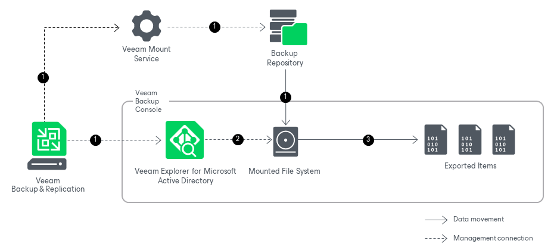

# How Export Works

Veeam Explorer for Microsoft Active Directory allows you to export your data to the machine where Veeam Explorer for Microsoft Active Directory is opened.

Exporting Microsoft Active Directory data works in the following manner:

1. After you select a restore point, Veeam Backup & Replication launches Veeam Explorer for Microsoft Active Directory. Meanwhile, Veeam Backup & Replication sends a mount command to the Veeam Mount Service running on the mount server associated with the backup repository. The Veeam Mount Service mounts the file system from the backup repository to the machine where Veeam Explorer for Microsoft Active Directory is opened.
2. Veeam Explorer for Microsoft Active Directory locates the ntds.dit file and the associated transaction logs (usually in the %SystemRoot%\NTDS folder) on the mounted file system. To read these files, Veeam Explorer for Microsoft Active Directory uses the native Windows Extensible Storage Engine dynamic link library (esent.dll) located in the %SystemRoot%\System32 folder of the machine where Veeam Explorer for Microsoft Active Directory is opened.
3. Veeam Explorer for Microsoft Active Directory converts the necessary data to the LDF format and saves it to the specified folder. Veeam Explorer for Microsoft Active Directory uses the Lightweight Data Interchange Format to save Active Directory objects and containers as LDF files.

You can make an exported LDF file available to an Active Directory Domain Services server by importing it with the ldifde utility. For more information, see [this Microsoft article](https://docs.microsoft.com/en-us/previous-versions/windows/it-pro/windows-server-2008-R2-and-2008/cc816781%28v%3Dws.10%29).

