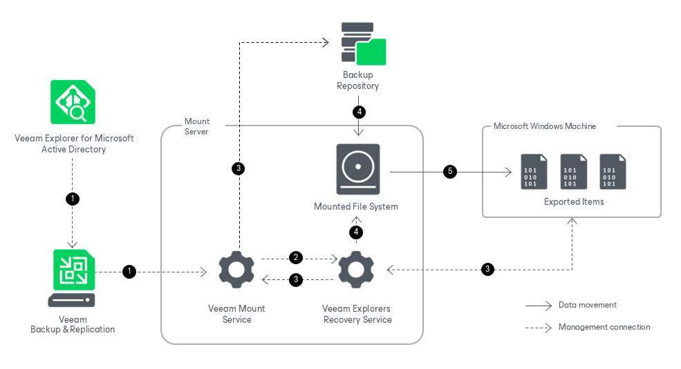

# How Export Works

Veeam Explorer for Microsoft Active Directory allows you to export your data to any Windows machine.

Exporting Microsoft Active Directory data works in the following manner:

1. To start the export process, Veeam Explorer for Microsoft Active Directory sends a restore command to the Veeam Mount Service. The service runs on the mount server associated with the backup repository.
2. The Veeam Mount Service delegates this request to the Veeam Explorers Recovery Service running on the same server.
3. The Veeam Explorers Recovery Service connects to the target server. The service validates the permissions of the selected user and checks if there is enough free space on the target server. The Veeam Explorers Recovery Service sends a request to the Veeam Mount Service to connect to the backup repository and initiate the mounting operation.

1. The Veeam Mount Service mounts the file system from the backup repository to the mount server.

The Veeam Explorers Recovery Service locates the ntds.dit file and the associated transaction logs (usually in the %SystemRoot%\NTDS folder) on the mounted file system. To read these files, the Veeam Explorers Recovery Service uses the native Windows Extensible Storage Engine dynamic link library (esent.dll) located in the %SystemRoot%\System32 folder of the mount server.

1. The Veeam Explorers Recovery Service converts the necessary data to the LDF format and saves it to the specified folder on the target Windows machine. The Veeam Explorers Recovery Service uses the Lightweight Data Interchange Format to save Active Directory objects and containers as LDF files.

You can make an exported LDF file available to an Active Directory Domain Services server by importing it with the ldifde utility. For more information, see [this Microsoft article](https://docs.microsoft.com/en-us/previous-versions/windows/it-pro/windows-server-2008-R2-and-2008/cc816781%28v%3Dws.10%29).

Page updated 2026-07-07

