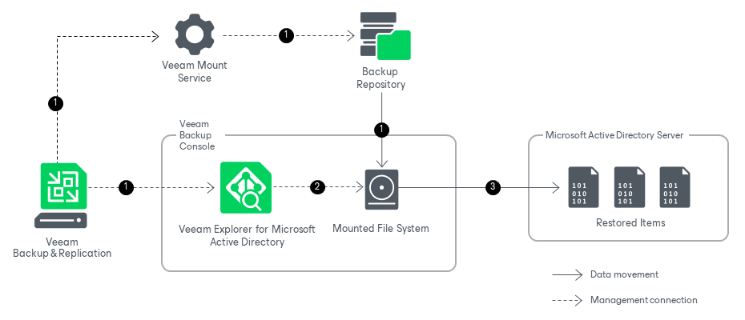

# How Restore Works

In this article

Restoring your data with Veeam Explorer for Microsoft Active Directory works in the following manner:

1. After you select a restore point, Veeam Backup & Replication launches Veeam Explorer for Microsoft Active Directory. Meanwhile, Veeam Backup & Replication sends a mount command to the Veeam Mount Service running on the mount server associated with the backup repository. The Veeam Mount Service mounts the file system from the backup repository to the machine where Veeam Explorer for Microsoft Active Directory is opened.
2. Veeam Explorer for Microsoft Active Directory locates the ntds.dit file and the associated transaction logs (usually in the %SystemRoot%\NTDS folder) on the mounted file system. To read these files, Veeam Explorer for Microsoft Active Directory uses the native Windows Extensible Storage Engine dynamic link library (esent.dll) located in the %SystemRoot%\System32 folder of the machine where Veeam Explorer for Microsoft Active Directory is opened.
3. Veeam Explorer for Microsoft Active Directory uses native Active Directory functionality to restore the selected items from the ntds.dit file on the mounted file system to the target machine. Data transfer is established through an LDAP connection.

Page updated 6/18/2024

Page content applies to build 13.0.1.1071
