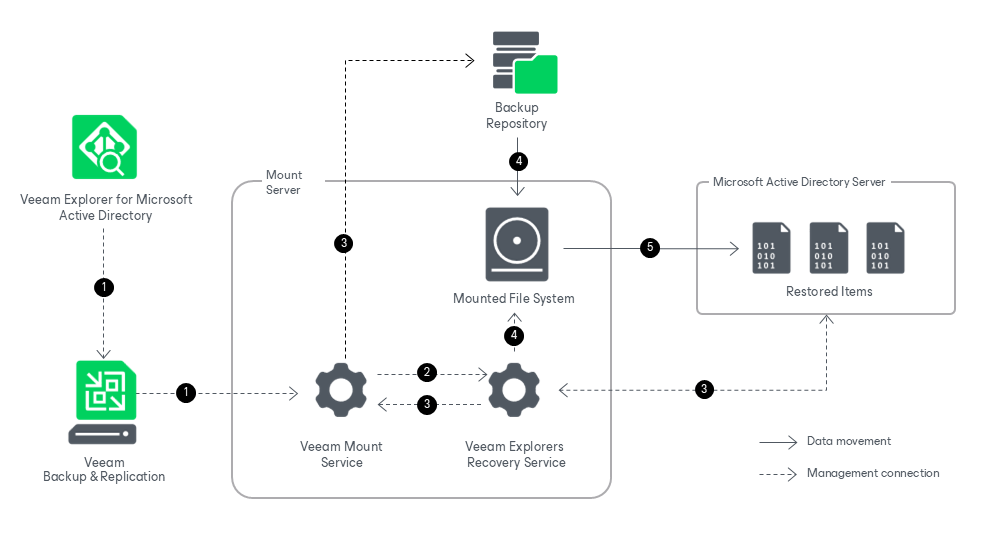

# How Restore Works

Restoring your data with Veeam Explorer for Microsoft Active Directory works in the following manner:

1. To start the restore process, Veeam Explorer for Microsoft Active Directory sends a restore command to the Veeam Mount Service. The service runs on the mount server associated with the backup repository.
2. The Veeam Mount Service delegates this request to the Veeam Explorers Recovery Service running on the same server.
3. The Veeam Explorers Recovery Service connects to the target server. The service validates the permissions of the selected user and checks if there is enough free space on the target server. The Veeam Explorers Recovery Service sends a request to the Veeam Mount Service to connect to the backup repository and initiate the mounting operation.

1. The Veeam Mount Service mounts the file system from the backup repository to the mount server.

The Veeam Explorers Recovery Service locates the ntds.dit file and the associated transaction logs (usually in the %SystemRoot%\NTDS folder) on the mounted file system. To read these files, the Veeam Explorers Recovery Serviceuses the native Windows Extensible Storage Engine dynamic link library (esent.dll) located in the %SystemRoot%\System32 folder of the mount server.

1. The Veeam Explorers Recovery Service uses native Active Directory functionality to restore the selected items from the ntds.dit file on the mounted file system to the target machine. Data transfer is established through an LDAP connection.

Page updated 2026-07-07

