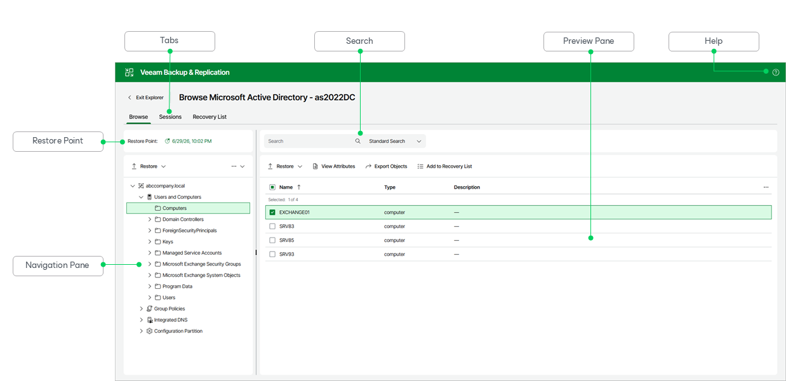

# Getting to Know Explorer Web UI

Veeam Explorer for Microsoft Active Directory provides you with a convenient user interface that allows you to perform required operations in a user-friendly manner.

The main application window contains the following UI elements:

* The Browse tab, which allows you to browse the hierarchy of objects in the backup. This tab contains the following elements:

* The Restore Point field, which shows the restore point you are browsing. To browse a different restore point, click the date. For more information, see [Selecting Restore Point](vead_selecting_restore_point_web_ui.md).
* The navigation pane, which allows you to browse through the hierarchy of containers. In its upper section, the navigation pane contains commands you can apply to the selected container.
* The Search field, which allows you to search for objects in the selected container. For more information, see [Browsing, Searching and Viewing Items](vead_browsing_web_ui.md#searching).
* The preview pane, which shows the objects in the selected container. In its upper section, the preview pane contains commands you can apply to the selected objects.

* The Sessions tab, which allows you to view restore sessions. For more information, see [Managing Restore Sessions](vead_restore_sessions_web_ui.md).
* The Recovery List tab, which allows you to manage a list of objects that can be exported or restored. For more information, see [Managing Recovery List](vead_recovery_list_web_ui.md).

* The Help button, which opens the online help.

Page updated 2026-07-09

