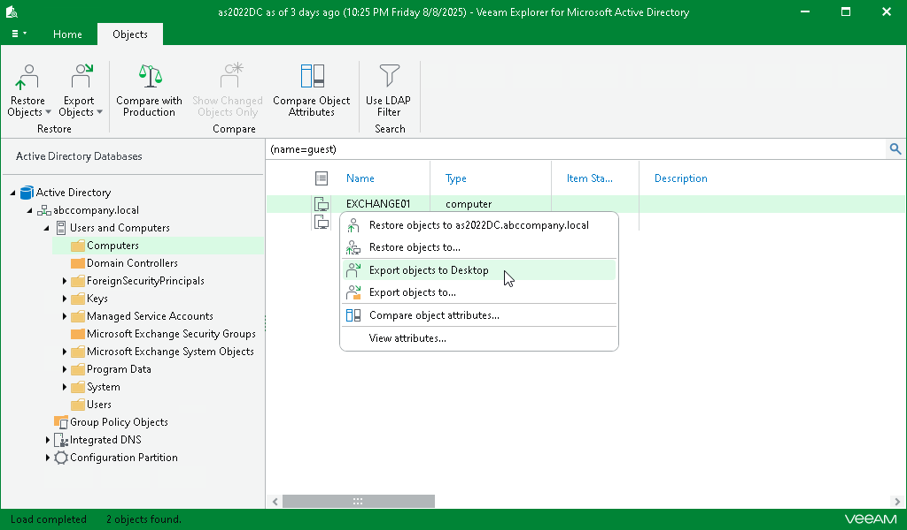

# Exporting Objects to Default Location

To export an object to the default location, do the following:

1. Select an object.
2. On the Objects tab, select Export Objects > Export Object to <target\_folder>.

Alternatively, you can right-click an object and select Export objects to <target\_folder>.

|  |
| --- |
| Note |
| The <target\_folder> destination depends on the location you used during the last export operation. |

Page updated 2026-05-26

