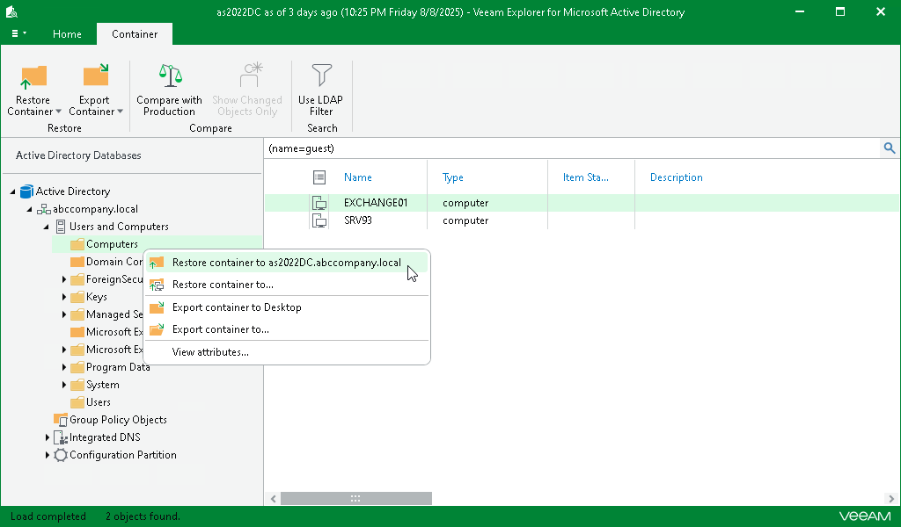

# Restoring Containers

To restore a container, do the following:

1. In the navigation pane, select a container.
2. On the Container tab, select Restore Container > Restore container to <original\_location> or right-click a container and select Restore container to <original\_location>.

|  |
| --- |
| Note |
| Before the restore process begins, you will be prompted to enter the source machine credentials. |

After the restore process is complete, review the results shown in the Restore Summary window. To do this, click See more to expand the window and review details of the restore operation.

You can filter notifications by their status: Error, Warning or Success.

