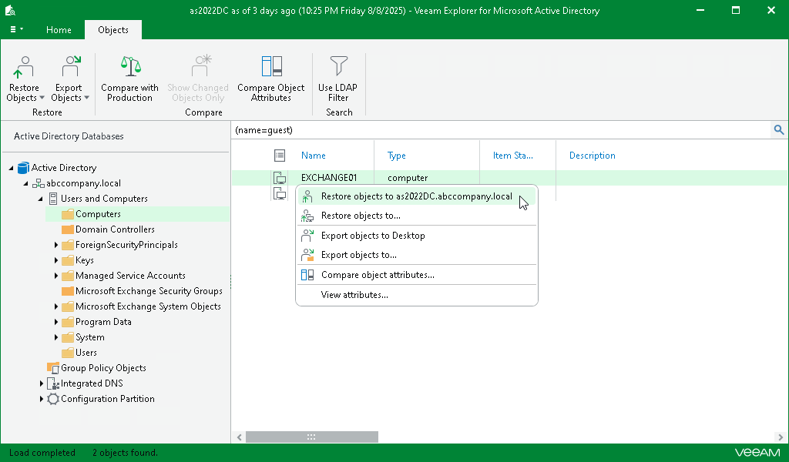
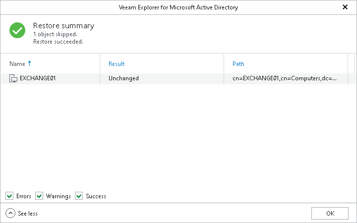

# Restoring Objects

In this article

To restore an object, do the following:

1. In the preview pane, select objects.
2. On the Objects tab, select Restore Objects > Restore objects to <original\_location> or right-click an object and select Restore objects to <original\_location>.

|  |
| --- |
| Note |
| Before the restore process begins, you will be prompted to enter the source machine credentials. |

After the restore process is complete, review the results shown in the Restore Summary window. To do this, click See more to expand the window and review details of the restore operation.

You can filter notifications by their status: Error, Warning or Success.

Page updated 8/21/2025

Page content applies to build 13.0.1.1071
