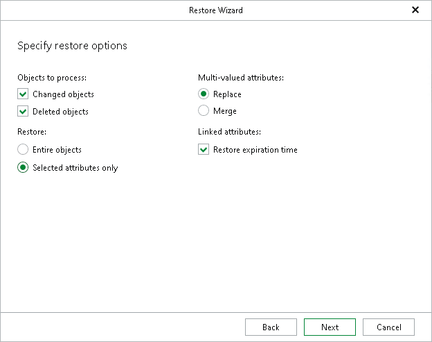

# Step 6. Specify Restore Options

At this step of the wizard, specify restore options.

You can select the following:

* Objects to process:

* Changed objects — to restore changed objects.
* Deleted objects — to restore deleted objects.

* Restore:

* Entire objects — to restore entire objects collection.
* Selected attributes only — to select particular attributes.

When selecting Selected attributes only, you will be offered to choose the attributes you want to restore in the next step.

* Multi-valued attributes:

* Replace — to replace production data with that of a backup file.
* Merge — to merge existing data with that of a backup file.

By default, multi-valued attributes will be replaced, not merged.

|  |
| --- |
| Note |
| * When working with a backed-up domain controller running Microsoft Windows Server 2016 and later, this dialog will also include the Restore expiration time option which allows you to restore expiration time for linked attributes. If an attribute being restored expires during the restore session, the attribute will not be restored. * Users cannot change recovery settings for disabled attributes. Such attributes will be either restored or skipped according to the default configuration. |

