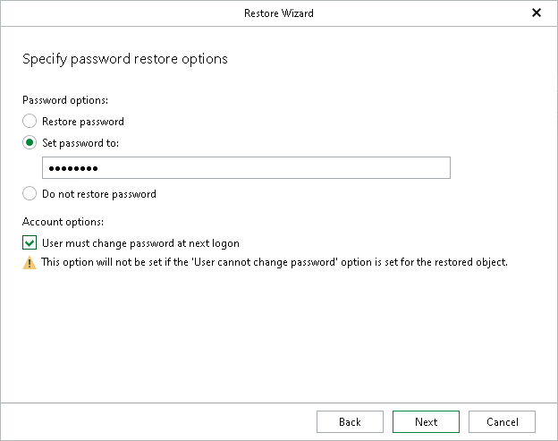

# Step 4. Specify Password Restore Options

At this step, select one of the following options:

* Restore password. To restore the password from the backup file.
* Set password to. To set a new password.
* Do not restore password. To skip restoring the password.

This option will not make any changes to the currently configured passwords in your environment.

Consider the following:

* When providing a new password, check that it complies with the password policy in your production environment.
* If you select Restore password or Set password to options, you can also request a user to change the password at next log on.

Keep in mind that this setting will not take effect if a user is not allowed to change the password due to security limitations.

* When restoring multiple accounts, a new password will be set for all the accounts altogether.

* To restore account passwords, Veeam Explorer for Microsoft Active Directory uses registry database. Make sure that the System registry hive is available.

The default location is %systemroot%\System32\Config.

* When restoring Active Directory database from an Active Directory backup file using file-level restore, the registry hive will be located automatically. Otherwise, make sure the system registry hive is located in the same folder as .DIT file.

