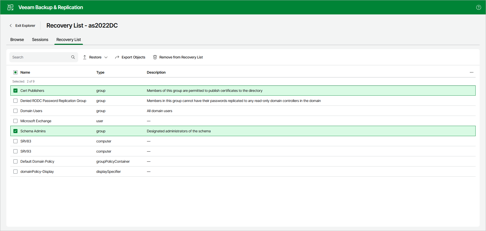

# Managing Recovery List

This option is only available in the Veeam Explorer for Microsoft Active Directory web UI.

The recovery list allows you to collect application items that you want to restore or export, and then perform the necessary operation on multiple objects at once.

To add items to the recovery list, open the Browse tab and do the following:

1. In the preview pane, select the necessary items.
2. In the upper part of the preview pane, select Add to Recovery List.

Alternatively, you can open the Browse tab, right-click an object and select Add to Recovery List.

|  |
| --- |
| Note |
| The Recovery List tab is only visible if you have added an object to the recovery list. |

To manage the recovery list, open the Recovery List tab. On this tab, you can do the following:

* To restore items, select the necessary items and perform either of the following actions:

* Select Restore > Restore objects to original location to restore the items to their original location.
* Select Restore > Restore objects to and complete the Restore wizard to restore the items to another location.

* To remove items from the recovery list, select the necessary items and select Remove from Recovery List.

To find specific items in the recovery list, use the Search field.

Page updated 2026-07-09

