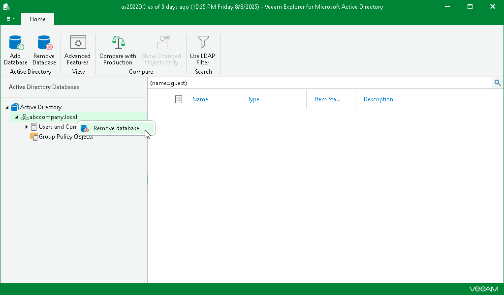

# Removing Standalone Databases

In this article

To remove a database from the application scope, right-click a database in the navigation pane and select Remove database.

Page updated 8/12/2025

Page content applies to build 13.0.1.1071
