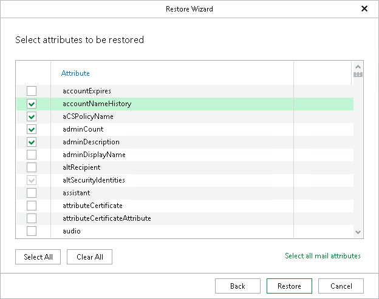

# Step 7. Specify Attributes to Restore

In this article

At this step of the wizard, select the necessary attributes and click Restore.

This step is available only if you have chosen the Selected attributes only option at the previous step.

Page updated 8/12/2025

Page content applies to build 13.0.1.1071
