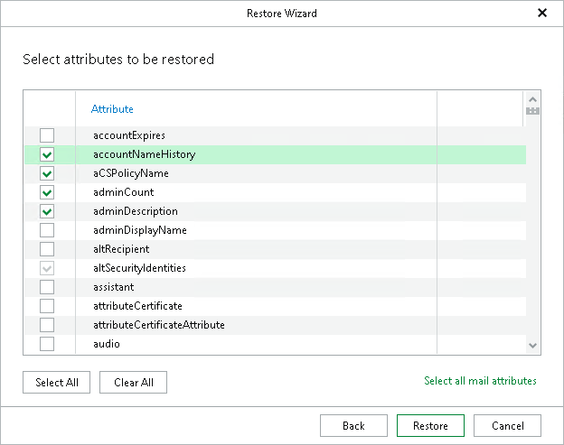

# Step 7. Specify Attributes to Restore

At this step of the wizard, select the necessary attributes and click Restore.

This step is available only if you have chosen the Selected attributes only option at the previous step.

Page updated 2026-05-26

