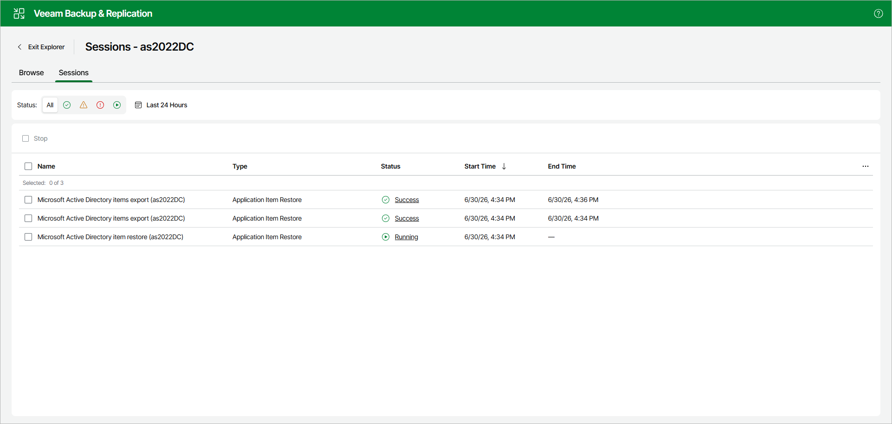

# Managing Restore Sessions

This option is only available in the Veeam Explorer for Microsoft Active Directory web UI.

Click the Sessions tab. The Sessions tab lists restore sessions with their name, type, status, start time and end time.

To track the progress of a session and view detailed information about it, click the session status in the Status column. Veeam Explorer for Microsoft Active Directory displays the session duration, status and the list of messages.

To stop a running session, select it and click Stop.

|  |
| --- |
| Tip |
| Consider the following:   * To display only sessions with a specific status, click the Success, Warning, Error or Running icon next to Status. To display sessions with any status, click All. * To configure the period for which Veeam Explorer for Microsoft Active Directory shows sessions, click the calendar icon and specify the time range. By default, it is set to Last 24 Hours. |

Page updated 2026-07-07

