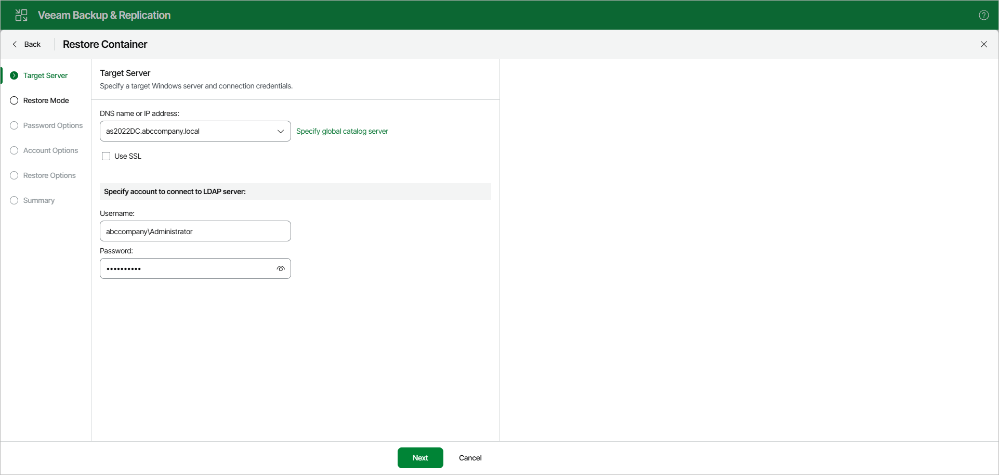
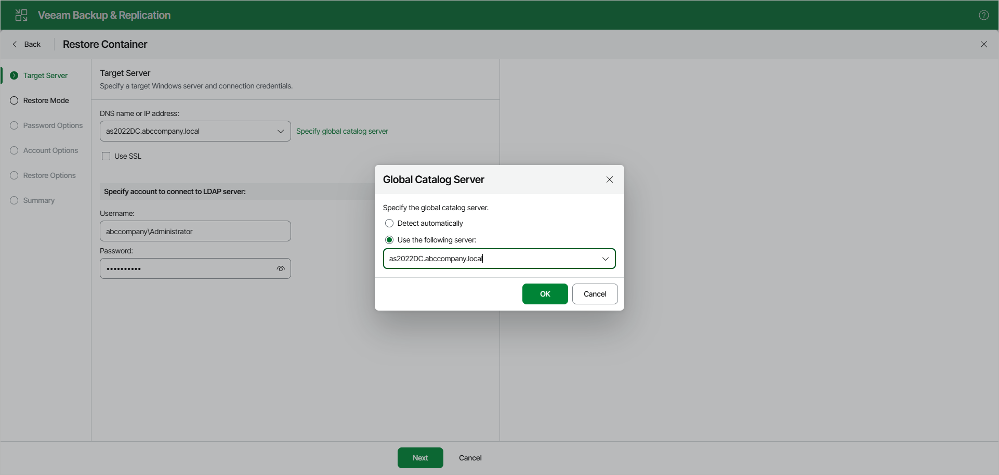

# Step 2. Specify Connection Parameters

At the Target Server step, do the following:

1. In the DNS name or IP address field, specify the target server to which you want to restore your data.

Select the Use SSL check box to establish a secure connection.

1. In the Specify account to connect to LDAP server section, provide a user name and password for the account.

Global Catalog Server

To specify a Global Catalog server, click Specify global catalog server on the right side of the DNS name or IP address field and select either of the following options:

* Detect automatically — to automatically detect a server.
* Use the following server — to choose a server from the list.

Page updated 2026-05-26

