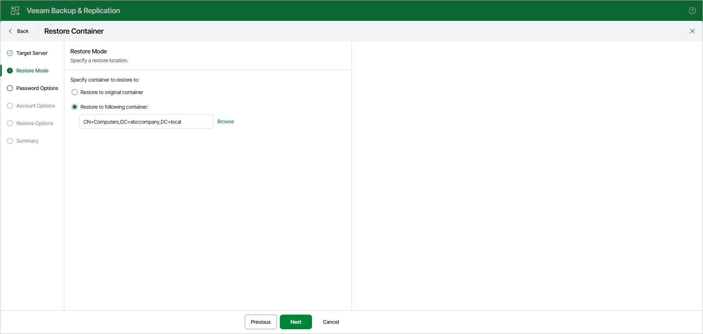
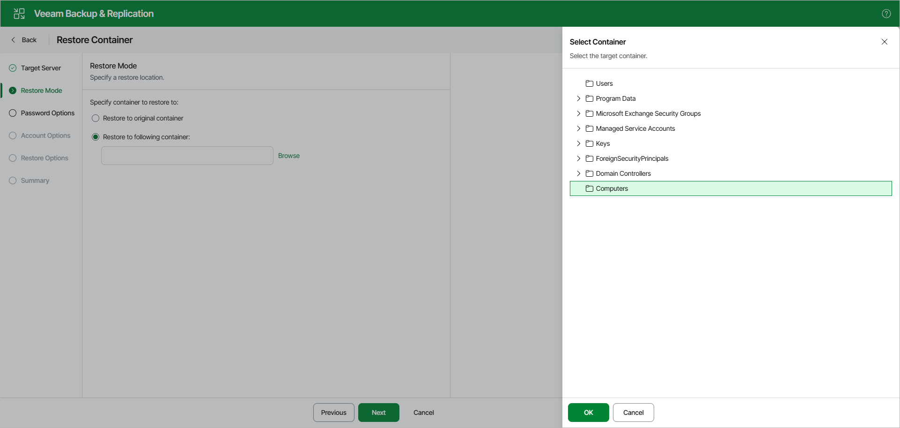

# Step 3. Specify Restore Location

At the Restore Mode step, select a container to which you want to restore the objects.

You can select the following:

* Restore to the original container — to restore data to the original container in your production environment.
* Restore to the following container — to select a different container, as described in [Browsing Container](#bc).

|  |
| --- |
| Note |
| If a container that is being restored was not found in the production environment, it will be restored anew. |

Browsing Container

To select a different container, click Browse and choose a container you want to use.

Page updated 2026-05-26

