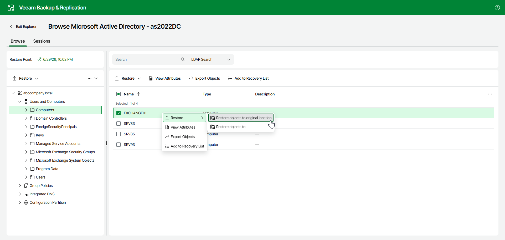

# Restoring Objects to Original Location

To restore objects to the original location, open the Browse tab and do the following:

1. In the preview pane, select objects.
2. In the upper part of the preview pane, select Restore > Restore objects to original location.

Alternatively, you can open the Browse tab, right-click the object and select Restore > Restore objects to original location.

Consider the following:

* Both changed and deleted objects will be restored.
* All the attributes will be restored.
* Attribute values and security descriptors will be replaced with that of a backup file.

|  |
| --- |
| Note |
| Before the restore process begins, you will be prompted to enter the source machine credentials. |

Page updated 2026-07-08

