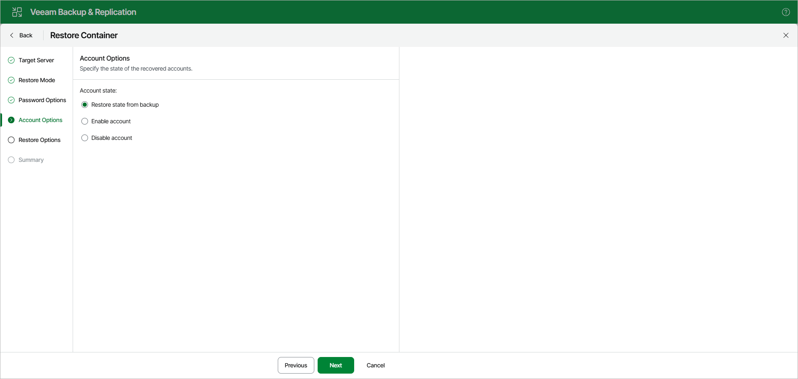

# Step 5. Specify Account State

At the Account Options step, select one of the following options to specify the state of the recovered accounts:

* Restore state from backup — recovers the account in the state saved in the backup file.
* Enable account — recovers the account in the enabled state.
* Disable account — recovers the account in the disabled state.

Page updated 2026-07-10

