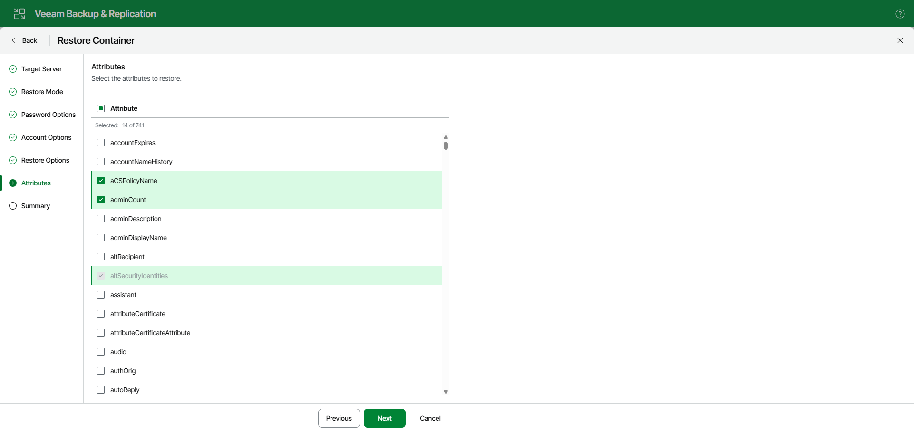

# Step 7. Specify Attributes to Restore

At the Attributes step, select the attributes that you want to restore.

This step is available only if you have chosen the Selected attributes only option at the previous step.

Page updated 2026-07-10

