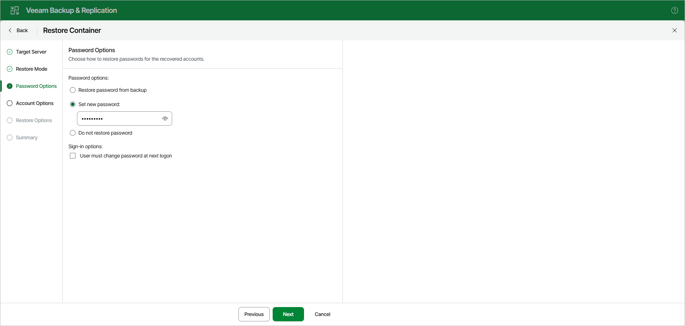

# Step 4. Specify Password Restore Options

At the Password Options step, select one of the following options:

* Restore password from backup. To restore the password from the backup file.
* Set new password. To set a new password.
* Do not restore password. To skip restoring the password.

This option will not make any changes to the currently configured passwords in your environment.

* If you select the Restore password from backup or Set new password option, you can also select the User must change password at next logon check box to require the user to change the password at the next logon.

Keep in mind that this setting will not take effect if a user is not allowed to change the password due to security limitations.

Consider the following:

* When providing a new password, check that it complies with the password policy in your production environment.

* When restoring multiple accounts, a new password will be set for all the accounts altogether.

* To restore account passwords, Veeam Explorer for Microsoft Active Directory uses registry database. Make sure that the System registry hive is available.

The default location is %systemroot%\System32\Config.

* When restoring Active Directory database from an Active Directory backup file using file-level restore, the registry hive will be located automatically. Otherwise, make sure the system registry hive is located in the same folder as .DIT file.

Page updated 2026-07-10

