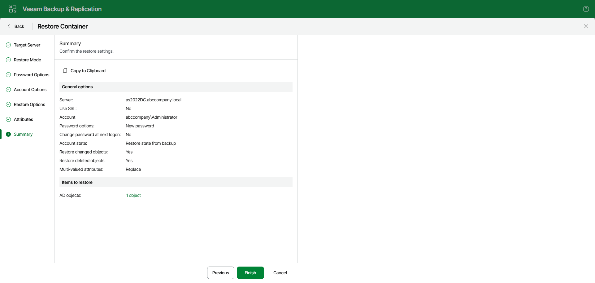

# Step 8. Review Restore Summary

At the Summary step, review the restore settings.

To copy the summary to the clipboard for later reference, click Copy to Clipboard.

To start the restore process, click Finish.

Page updated 2026-07-10

