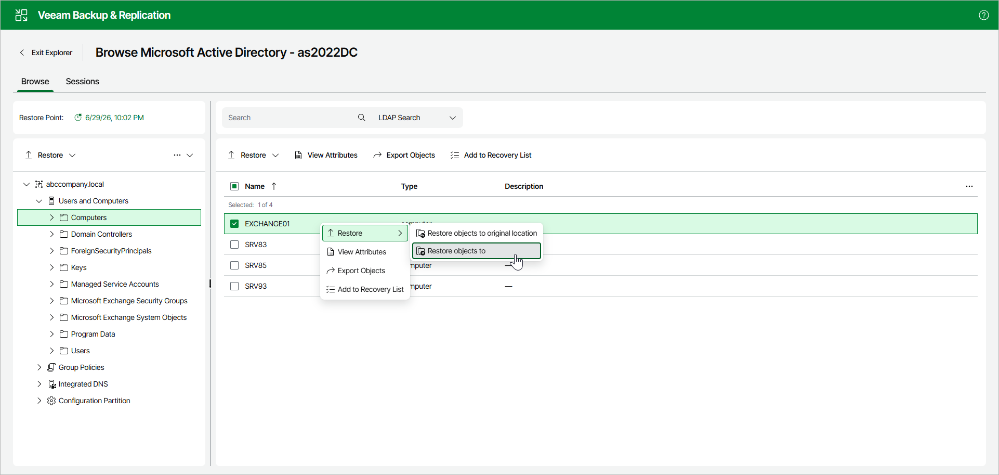

# Step 1. Launch Restore Wizard

To launch the Restore wizard, open the Browse tab and do the following:

1. In the preview pane, select objects.
2. In the upper part of the preview pane, select Restore > Restore objects to.

Alternatively, you can open the Browse tab, right-click an object and select Restore > Restore objects to.

Page updated 2026-07-08

