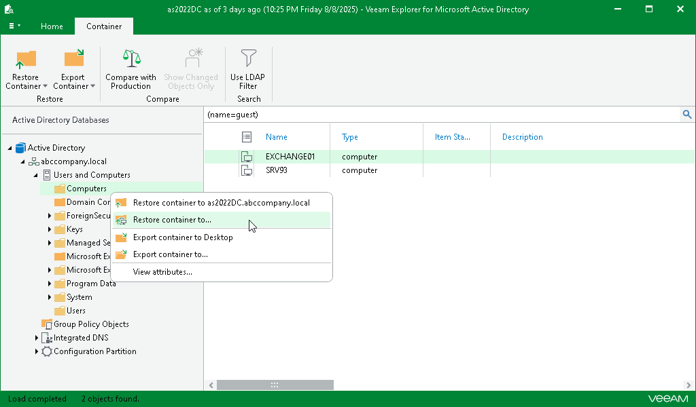

# Step 1. Launch Restore Wizard

To launch the Restore wizard, do the following:

1. In the preview pane, select an object.
2. On the Container tab, select Restore Container > Restore container to or right-click a container and select Restore container to.

